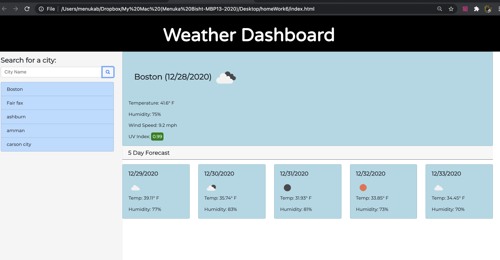

# weatherapiHw6

Description:

This weather dashboard application has functionality to  help user find current weather conditions. This application  uses the OpenWeather API to retrieve weather data for different cities. Using this application user can also  search history Clicking on the city name performs a new search that returns current and future conditions for that city.Lastly, this app includes a 5-Day Forecast below the current weather condition.

Technology used :

Bootstrap ,Font Awesome, JavaScript,jQuery,Moment.js, 
 OpenWeatherMap

 Screen shot :

 

